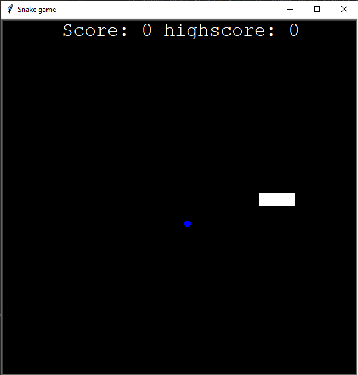

# snake_game_python

## Project Overview
A classic Snake Game built with Python using object-oriented programming principles.

## Features
- Snake movement and controls
- Food collision detection
- Score tracking system
- Game over logic

## Technologies Used
- Python
- Turtle Graphics
- OOP (Classes & Objects)

## Project Structure
- `main.py` → game loop
- `snake.py` → snake behavior and movement
- `food.py` → food generation
- `scoreboard.py` → score tracking system

## Concepts Practiced
- Object-Oriented Programming
- Classes and Methods
- Python Modules
- Game Logic
  
## Preview

